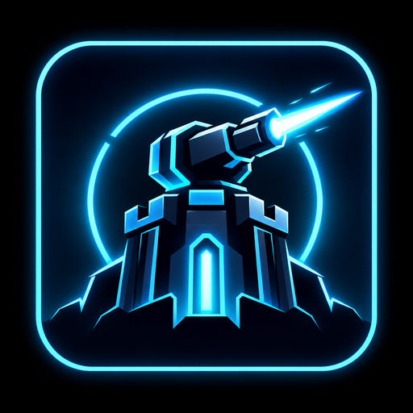
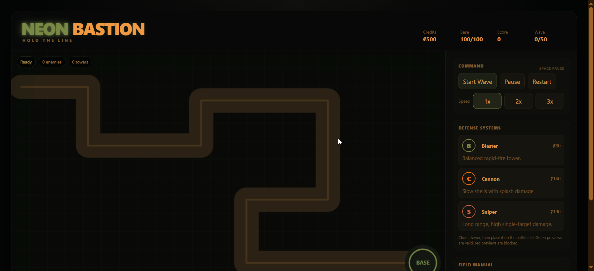

<p align="center">
  
</p>
<p align="center">
  
</p>

# Neon Bastion - Hold the Line

A browser-based tower defense game.

The objective is simple: defend the base against progressively harder waves of enemies by strategically placing, upgrading, and selling defensive towers.

The game contains 50 waves, 3 different tower types, 4 enemy types, automatic tower targeting, tower upgrades, selling, currency, scoring, pause/restart controls, game-speed controls, victory and game-over states, and a dedicated performance stress test.

---

## Links

- **Deployed Game:** https://neon-bastion-v2.vercel.app/
- **Demo Video:** []
- **Source Code:** https://github.com/amanpandey04/neon-bastion-v2

---

# 1. Architecture

The game is divided into two main parts:

```text
React
│
├── HUD
├── Tower Shop
├── Tower Upgrade / Sell UI
├── Pause / Restart Controls
├── Performance UI
└── Victory / Game Over Screens
        │
        ↓
Game Engine
│
├── Game Loop
├── Enemy System
├── Tower System
├── Projectile System
├── Wave System
├── Collision / Damage
├── Object Pools
├── Spatial Grid
└── Canvas Renderer
```

## React

React is responsible for the user interface only.

It handles:

Game HUD, Currency, Base health, Score, Wave information, Tower selection, Tower upgrade and selling controls, Pause/restart controls, Game speed controls, Victory and game-over screens, Performance benchmark information etc.

The individual enemies, towers and projectiles are **not represented as React components or React state**.

## Game Engine

The `GameEngine` class contains the actual simulation.

It manages:

Enemy movement, Tower targeting, Projectile movement, Damage, Wave progression, Tower placement, Tower upgrades, Tower selling, Player health, Currency, Score, Object pools, Spatial indexing, Rendering etc.

The game engine runs independently of React and sends React only a lightweight snapshot containing information required by the UI.

---

# 2. Rendering Approach

The game uses the **HTML5 Canvas 2D API** for rendering the game world.

React is used around the Canvas for the interface.

This creates a clean separation.

Using thousands of DOM elements or React components for moving entities would introduce unnecessary overhead.

---

# 3. Game Systems

## Enemies

There are four enemy types:

### Drone

The standard balanced enemy.

- Medium health
- Medium speed
- Normal damage to the base

### Runner

A fast but weaker enemy.

- Low health
- High movement speed
- Designed to pressure towers and punish weak coverage

### Tank

A slow, high-health enemy.

- Very high health
- Slow movement
- Higher base damage

### Armored

A resistant enemy.

- Medium/high health
- Moderate speed
- Takes reduced damage

The enemy types are deliberately different so that tower selection and placement matter.

---

## Towers

There are three tower types.

### Blaster

A balanced rapid-fire tower.

- Medium damage
- Medium range
- Fast firing

### Cannon

A slow heavy tower.

- High damage
- Slower fire rate
- Splash damage

### Sniper

A long-range high-damage tower.

- Very long range
- Very high single-target damage
- Slow fire rate

Each tower can be upgraded to level 3.

The tower's statistics change with each upgrade, including damage, range and firing speed.

---

# 4. Wave System

The game contains **50 waves**.

Enemy count and difficulty increase progressively through:

- Number of enemies
- Enemy health
- Enemy speed
- Enemy composition
- Stronger enemy types

Different enemy types are introduced gradually rather than placing every enemy type into Wave 1.

The later waves contain significantly larger enemy groups and stronger combinations.

Successfully completing all 50 waves produces the victory state.

---

# 5. Major Performance Bottlenecks

The initial implementation exposed several potential bottlenecks.

The most important challenge was that the assignment requires:

```text
5,000 active enemies
100 towers
1,000 active projectiles
```

at the same time.

The major areas that needed attention were:

### 1. Rendering thousands of objects

Rendering thousands of enemies and projectiles every frame can become expensive, especially when every entity requires multiple Canvas operations.

### 2. Enemy targeting

If every tower checked every enemy, the cost would grow rapidly.

With `100 towers × 5,000 enemies` that could require approximately 500,000 candidate checks for a single targeting pass.

### 3. Object creation and garbage collection

Constantly creating and destroying thousands of enemies and projectiles can generate garbage and cause garbage-collection pauses.

### 4. React rendering overhead

Putting thousands of moving entities into React state would cause unnecessary React updates and was therefore avoided.

### 5. Large frame-time spikes

The initial stress test showed severe frame drops, including approximately 10-20 FPS in the initial implementation.

This made it clear that simply making the gameplay functional was not enough. The underlying architecture needed to be optimized.

---

# 6. Initial LLM Implementation

The first implementation was used as a baseline before performance optimization.

Under the assignment stress scenario, with approximately:

```text
5,000 enemies
100 towers
1,000 projectiles
```

the initial implementation dropped into roughly the:

`10-20 FPS` range.

Chrome Performance profiling showed significant frame-time spikes and made it clear that the initial implementation was not suitable for the required stress workload.

This initial failure was used as the baseline for subsequent optimization.

---

# 7. Optimizations Used

## 7.1 Single Game Loop

Instead of using one timer or animation loop for each entity, the game uses one central `requestAnimationFrame()` loop.

This means the entire simulation is updated centrally.

---

## 7.2 Fixed Timestep

The game simulation runs using a fixed timestep:

`1 / 60 second`

This makes simulation behavior more consistent across different display refresh rates.

---

## 7.3 React / Game Engine Separation

The game entities remain inside the game engine.

React receives only lightweight UI snapshots.

The positions of thousands of enemies and projectiles are never pushed through React state every frame.

---

## 7.4 Object Pooling

Enemies and projectiles use reusable object pools.

This reduces unnecessary memory allocations and garbage-collection pressure.

---

## 7.5 Spatial Grid

The map is divided into a spatial grid.

Instead of having towers search the complete enemy list, each tower queries only nearby grid cells.

A tower only needs to consider enemies in cells around it.

This dramatically reduces unnecessary target checks.

---

## 7.6 Direct Enemy Lookup

Enemies are stored in a `Map` using their unique IDs.

This allows projectiles to find their target directly rather than scanning the entire enemy array.

---

## 7.7 Rendering Culling

Objects outside the visible game area are skipped during rendering.

This prevents unnecessary rendering work for objects that the player cannot see.

---

# 8. Performance Measurement

Performance was measured in two ways.

## Chrome DevTools Performance

Chrome DevTools Performance was used to inspect:

- Frame durations
- Rendering
- Long frames
- Dropped frames

The initial implementation produced severe frame drops under stress.

---

## In-Game Performance Profiler

A lightweight profiler was added to the game engine to measure:

- Total frame time
- Update time
- Render time
- Enemy update time
- Tower update time
- Projectile update time

This was used to identify which systems were consuming the most time.

---

# 9. Final Stress Test

The final stress benchmark uses:

```text
5,000 enemies
100 towers
1,000 projectiles
```

The benchmark includes:

```text
2-second warm-up and
30-second measurement period
```

The warm-up exists to exclude one-time initialization costs from the sustained-performance measurement.

The benchmark is intentionally kept separate from the normal gameplay experience so that the performance test does not interfere with normal game balance.

---

# 10. The Major Challenge

The biggest challenge was **performance architecture**.

Building the basic tower defense mechanics was relatively straightforward compared with making the simulation behave efficiently with thousands of simultaneously active entities.

The initial implementation was functional but showed that simply having the game work was not enough.

The main challenge was understanding where the workload was actually coming from and then changing the architecture rather than applying random micro-optimizations.

The most important lessons were:

1. React should not be responsible for rendering thousands of high-frequency game entities.
2. A game should use one central simulation loop rather than one timer per entity.
3. Data structures matter significantly when entity counts become large.
4. Spatial partitioning is useful when many objects repeatedly need proximity checks.
5. Profiling should happen before optimizing so that effort is spent on actual bottlenecks.

---

# 11. AI Usage

AI tools were used throughout development.

They were primarily used for:

- Brainstorming architecture
- Debugging issues
- Reviewing performance results
- Suggesting optimization techniques
- Improving UI ideas

The initial AI-generated implementation was deliberately treated as a starting point rather than the final implementation.

The initial stress test exposed performance problems, which led to profiling, architectural changes, and performance optimization.

---

# 12. Controls

### Mouse

- Select a tower from the sidebar
- Click a valid location to place it
- Click an existing tower to select it

### Keyboard

```text
SPACE  → Pause / Resume
ESC    → Cancel current selection
```

### Game controls

`1x, 2x, 3x` control the simulation speed.

The game can also be restarted at any time.

---

# 13. Project Structure

```text
src/
│
├── App.jsx
├── main.jsx
├── styles.css
│
└── game/
    │
    ├── data.js
    ├── entities.js
    ├── utils.js
    ├── ObjectPool.js
    ├── SpatialGrid.js
    └── GameEngine.js
```

### `App.jsx`

React user interface and HUD.

### `GameEngine.js`

Main simulation, game loop, combat, waves and rendering.

### `data.js`

Tower data, enemy data, map configuration and wave configuration.

### `entities.js`

Enemy, Tower and Projectile data structures.

### `ObjectPool.js`

Reusable object pools for entities.

### `SpatialGrid.js`

Spatial partitioning for efficient proximity queries.

### `utils.js`

Math and geometry helper functions.

---

# 14. Deployment

The project is a client-side Vite application and does not require a backend or database.

Production build:

```bash
npm install
npm run build
```

The generated application can be deployed to any static hosting provider.

The deployed version for this submission is:

**https://neon-bastion-v2.vercel.app/**

---

# 15. Demo Video

The required demo video is available here:

**[]**

The video demonstrates:

1. The initial LLM implementation and the visible performance breaking point.
2. The performance problems and the optimization approach.
3. The optimized implementation under the final stress workload.
4. The completed playable game and its major mechanics.

---
